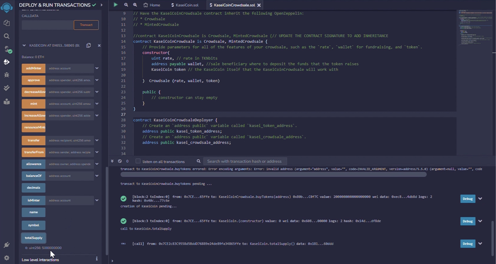

# crowdsale
The purpose of this repository is to create a new cryptocurrency named KaseiCoin, which will be based on blockchain technology and used to facilitate trade on mars.
KaseiCoin will be a fungible token that is ERC-20 compliant, which will ensure its interoperability with other cryptocurrencies. To make KaseiCoin accessible to people moving to Mars, a crowdsale will be launched, allowing them to convert their earthling money to KaseiCoin.

The use of blockchain technology in a Martian economy has several advantages, including its ability to facilitate transparent and secure transactions. Additionally, the use of KaseiCoin will allow for the creation of a new economic system that is independent of Earth-based currencies.

The launch of KaseiCoin and the adoption of blockchain technology in the Martian economy represent a significant step forward in the development of a sustainable and self-sufficient colony on Mars. The success of this new monetary system could have far-reaching implications for the future of space exploration and the development of extraterrestrial economies.

 

KaseiCoin

 

Crowdsale

 

<b>Results for crowdsale</b>

The following section entails how the code for the crowdsale was compiled, an initial supply of 5 billion coins being bought and then another 200,000 coins being minted to give a total supply of 5000200000 coins.
Deploy the crowdsale to a local blockchain by using Remix, MetaMask, and Ganache.

Test the functionality of the crowdsale by using test accounts to buy new tokens and then checking the balances of those accounts.

Review the total supply of minted tokens and the amount of wei that the crowdsale contract has raised.

 

We use OpenZeppelin to extend the functionality of our crowdsale contract by adding time restrictions, refund capabilities, and a cap for the number of tokens that can be created.

 

<b>Results for Crowdsale in a timed way to reach the goal</b>

